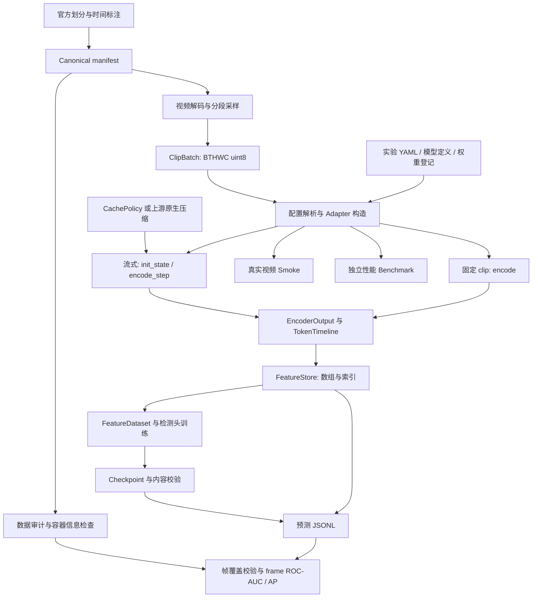

# VADBench 当前代码架构与项目信息

整理日期：2026-09-17。本文面向项目交接、架构理解和后续开发，汇总当前工作树的实现、实验配置、运行边界和证据入口。

## 1. 项目定位与当前结论

VADBench 是一个可插拔的视频表征与异常检测实验框架，以 UCF-Crime 为首个基准，统一比较固定 clip 编码器和能够跨片段传递状态的长视频模型。框架把数据导入、采样、编码、缓存压缩、冻结特征训练和帧级评测分开，借助统一契约和运行记录追溯结果。

当前已实现从 manifest 到特征、检测头、预测和评测的主链路，也具备模型接入冒烟和独立性能测试工具。已有真实权重 CPU 验证，但尚无完整 UCF-Crime 基准结果；GPU 前向复核在最近一份运行证据中仍未完成。

| 项目 | 当前信息与依据 |
|---|---|
| 包名 / 版本 | `vadbench` / `0.1.0`，见 [pyproject.toml](../../pyproject.toml) |
| Python 支持范围 | `>=3.10,<3.13` |
| 主源码 / 命令入口 | `src/vadbench/`；`vadbench` 或 `python -m vadbench` |
| 本地 / 服务器工作区 | `D:/PythonProject/VAD` / `ibnode3:/users/fotile/VAD` |
| 当前分支 | `qzt/refactor-vadbench-simplification` |
| Git HEAD | `0badc3435e734a841110e29d497940bfda7cc707` |
| 工作树状态 | 两端都有未提交改动；HEAD 不能单独标识当前实现 |
| 模型登记规模 | 25 个研究候选、21 个运行 catalog 条目、21 项 checkpoint 登记 |
| 最近完整验证记录 | 2026-09-12；详见[验证证据](../evidence/implementation-validation-2026-09-12.json) |

**2026-09-17 代码一致性核对：** 本地与服务器的 `src`、`tests`、`configs`、`schemas`、`registry`、`integrations`、`scripts`、`lab_anomaly`，以及 `pyproject.toml`、`uv.lock` 共 245 个文件，文件集合相同，统一 CRLF/LF 后逐文件 SHA-256 相同。检查包含新增和未提交文件，排除 Python 字节码缓存。该结论来自当日只读核对，不覆盖整个目录、虚拟环境、权重、数据和运行产物，也不代表本次新增文档已同步到服务器。

本文中的代码结构与参考配置按当前工作树核对；测试结果、数据缺失和 GPU 故障按 9 月 12 日证据引用。本次没有重新执行模型前向、全量测试或服务器资源巡检。

## 2. 总体架构



主实验流程是先冻结 encoder 抽取 train/test 特征，再训练检测头并评测。`smoke` 验证真实模型能否加载、前向并满足输出契约；`benchmark` 测量运行时间、吞吐、显存和缓存行为。二者不会自动完成检测头训练或证明异常检测精度。

## 3. 目录与模块责任

| 路径 | 职责 |
|---|---|
| [`src/vadbench/cli.py`](../../src/vadbench/cli.py) | 命令解析与阶段编排 |
| [`contracts.py`](../../src/vadbench/contracts.py) | 输入、输出、时间轴、能力声明、流式状态和缓存契约 |
| [`config.py`](../../src/vadbench/config.py)、[`orchestration.py`](../../src/vadbench/orchestration.py) | 实验结构校验、模型配置合并、权重绑定、能力协商和策略构造 |
| [`registry.py`](../../src/vadbench/registry.py)、[`integrations/catalog.py`](../../src/vadbench/integrations/catalog.py) | 惰性注册、运行目标发现和 adapter 实例化 |
| [`integrations/`](../../src/vadbench/integrations) | 上游模型加载、预处理、特征读出、状态管理及进程通信 |
| [`data/`](../../src/vadbench/data) | Manifest、UCF 导入、数据审计、采样、解码、特征数据集与标签投影 |
| [`features.py`](../../src/vadbench/features.py) | 特征数组、内容校验、索引写入与读取 |
| [`models/heads.py`](../../src/vadbench/models/heads.py)、[`tasks.py`](../../src/vadbench/tasks.py) | Attention/Top-k MIL、时序 head 与监督损失 |
| [`engine/`](../../src/vadbench/engine) | 抽取、冻结检测头训练、预测、覆盖校验、评测和接入矩阵 |
| [`compression.py`](../../src/vadbench/compression.py) | 框架侧缓存压缩策略 |
| [`artifacts.py`](../../src/vadbench/artifacts.py)、[`hashing.py`](../../src/vadbench/hashing.py) | 预测、运行身份、阶段记录、缓存遥测和统一 SHA-256 helper |
| [`smoke.py`](../../src/vadbench/smoke.py) | 真实输入的输出健康检查及 smoke v2 结果 |
| [`benchmark.py`](../../src/vadbench/benchmark.py)、[`benchmark_plan.py`](../../src/vadbench/benchmark_plan.py)、[`benchmark_runtime.py`](../../src/vadbench/benchmark_runtime.py) | 性能计划、计时统计、可比性判断和隔离模型运行环境 |
| [`environment_registry.py`](../../src/vadbench/environment_registry.py) | 四组模型环境及 overlay 配置解析 |
| [`resources.py`](../../src/vadbench/resources.py) | 安装后的 wheel 内置配置、登记表、schema 与上游锁定位 |
| `configs/`、`registry/`、`schemas/`、`integrations/` | 实验/模型定义、静态登记、版本化契约和上游代码锁 |
| [`scripts/server/`](../../scripts/server) | 环境、资产、overlay 管理与跨环境原生冒烟 |
| [`tests/`](../../tests) | 契约、数据、训练评测、模型桥接、服务器工具和打包验证 |
| [`lab_anomaly/`](../../lab_anomaly) | 保留的本地训练与 RTSP 原型；不作为当前正式基准入口 |
| `data/`、`weights/`、`external/`、`outputs/` | 数据、权重、第三方代码和运行产物；大型实体不进入 Git |

`lab_anomaly` 中的 VideoMAE V2 包装模块已重导出主包实现。旧原型使用自己的数据、训练和服务入口，没有统一承担 VADBench 的官方划分、帧级评测与 provenance 契约，详见[旧模块说明](../../lab_anomaly/README-CN.md)。

## 4. 核心契约与两类编码路径

### 4.1 输入、输出和时间轴

| 对象 | 关键内容 | 用途 |
|---|---|---|
| `ClipBatch` | `frames[B,T,H,W,C] uint8`、视频 ID、时间戳、原帧索引、有效帧 mask | 让像素与原视频时间坐标一起传递 |
| `EncoderOutput` | `features[B,S,D]`、可选 `pooled[B,D]`、timeline、aux | 统一不同编码器的输出容器 |
| `TokenTimeline` | 每个 token 的时间支持范围，可带原帧区间 | 保留输出与原视频的对应关系 |
| `EncoderCapabilities` | 输入限制、特征、流式及缓存能力 | 在构造和调用边界检查请求是否受支持 |
| `StreamState` / `StreamStep` | 视频身份、步数、私有状态、输出及缓存更新 | 表达跨 chunk 的状态传递 |
| `CacheView` / `CacheUpdate` | 缓存类型、序列轴、tensor、时间轴与更新方式 | 让压缩和遥测针对明确的缓存对象 |

这里 `B` 为批大小，`T` 为输入帧数，`S` 为输出 token/序列长度，`D` 为特征维度。输出形状一致不意味着语义一致：pooled vector、空间 patch token、视觉记忆和 decoder contextual token 必须分别标注。

采样段范围与 token 时间轴也不同。当前 32 段实验在每段中心选一个 clip；预测阶段使用完整 segment 范围覆盖原视频，不能把中心 clip 的较窄时间范围误当成整个段的范围。

### 4.2 固定 clip 与流式路径

- **固定路径：** `VideoEncoderAdapter.encode()` 对每个 clip 独立前向。VideoMAE V2 属于这一类，模型内部存在 Transformer 不构成跨 clip KV cache。
- **流式路径：** `StreamingVideoEncoderAdapter` 使用 `init_state → encode_step → finalize`，同一视频按顺序传递状态，新视频重新初始化。框架检查视频边界、步数和时间顺序。
- **缓存类型：** `vision_tokens` 表示视觉/投影 token，`visual_memory` 表示视觉记忆，`decoder_kv` 表示语言模型 decoder 的 key/value。Q-Former 的视觉 key/value 不等于 decoder KV。
- **压缩边界：** 框架 `CachePolicy` 与 HERMES 上游 `predict_and_compress` 分别配置和记录。框架 `identity` 只表示不做外部压缩；HERMES raw 对照还需显式设置 `native_compression_mode: off`。

HERMES 的 `projected_visual` 在 decoder 之前读出；研究历史 decoder cache 对表征或精度的影响，应使用 `decoder_contextual`。当前 HERMES 主实验已经显式选择后者。更多实现细节见[编码器运行机制](encoder-runtime.md)。

当前流式 chunk 使用单视频 `B=1`。所有 adapter 的像素归一化和输入布局转换由模型接入层负责。

## 5. 配置、注册与模型接入

| 配置来源 | 解决的问题 |
|---|---|
| [`registry/encoder-candidates.yaml`](../../registry/encoder-candidates.yaml) | 为什么保留某模型、许可/资产阻塞、环境归属；共 25 个候选 |
| [`registry/encoder-integrations.yaml`](../../registry/encoder-integrations.yaml) | 框架可发现的 adapter import string、能力和定义；共 21 项 |
| [`configs/encoders/`](../../configs/encoders) | 模型 constructor、输入 profile、特征阶段与缓存语义；共 25 份 |
| [`registry/checkpoints.yaml`](../../registry/checkpoints.yaml) | 权重来源、revision、许可证、路径、文件列表和校验值；共 21 项 |
| [`integrations/`](../../integrations) 下的 `upstream.lock.yaml` | 上游代码仓库、固定 revision 和入口；共 25 份 |
| [`registry/encoder-environments-v2.yaml`](../../registry/encoder-environments-v2.yaml) | 解释器、依赖版本、环境分组及 overlay |
| [`configs/experiments/`](../../configs/experiments) | 数据、采样、encoder、streaming、task、training 和 output 的组合 |

`EncoderRegistry` 惰性导入目标；列举模型不加载重型模型。`resolve_encoder_config()` 统一解析构造参数，按登记默认值、encoder definition、实验 `encoder.params` 和显式 device 合并；`create_encoder_from_experiment()` 校验实际权重绑定与身份后构造模型。模型特有选项写在 `encoder.params`，不要使用已拒绝的顶层 `encoder.model/precision`。

实验 YAML 没有隐式多级继承；`load_experiment()` 仅在调用方显式传入 `defaults` 时做深合并。

checkpoint 的 `constructor_key` 明确实际承载权重的参数。实现会拒绝不存在的权重 ID、adapter 不匹配和冲突覆盖；运行身份取实际加载资产的摘要。静态 catalog 的 `integrated` 不能代替真实运行的 `smoke_pass`，后者必须来自带日期、输入和日志的结果文件。

新增模型通常需要同步维护 candidate、upstream lock、checkpoint、encoder definition 和 runtime catalog，实现最小 adapter 特例，再用真实权重与视频验证。只有真实跨 chunk 复用状态的实现才声明 streaming 能力。

## 6. 数据、训练与评测

1. **导入与审计：** `data/ucf_crime.py` 解析官方划分和时间标注；`data/manifest.py` 校验记录、重复 ID、相对路径和 split 泄漏；`data/audit.py` 检查官方来源身份、视频计数、文件与容器信息、manifest hash 和评测条件。
2. **采样与抽取：** `data/sampling.py`、`data/video.py` 产生统一 batch；`engine/extract.py` 处理固定或流式 adapter 输出并写入 `FeatureStore`。短段 padding 带有效 mask，原视频坐标保留。
3. **冻结特征训练：** `FeatureDataset` 选定 encoder fingerprint，并核对 split/label；`engine/runner.py` 训练 MIL 或时序检测头，保存 checkpoint、校验信息与 history。当前主链不做 encoder 联合微调。
4. **预测：** `engine/predict.py` 读取已验证 checkpoint 与特征，输出携带时间区间的预测；默认拒绝缺口、重叠、越界等不完整帧覆盖。
5. **评测：** `engine/evaluate.py` 将区间分数投影到帧，与 manifest 的时序真值对齐，再拼接全部视频计算 micro frame ROC-AUC/AP。帧级真值不由预测记录中的视频级标签推断。

| 评测模式 | 边界 |
|---|---|
| `official`（CLI 默认） | 官方测试协议、严格覆盖、匹配且通过的 audit v2 |
| `subset` | 测试子集评测，仍要求完整帧覆盖；不可标成全量官方结果 |
| `generic` | 显式诊断模式，保留通用投影行为；不能替代正式协议门禁 |

三种模式仍要求测试集记录与预测视频集合匹配。当前评测输出的协议 ID 分别是 `ucf-crime/official-frameauc-v1`、`ucf-crime/subset-frameauc-v1`、`ucf-crime/generic-frameauc-v1`。`predict --allow-incomplete-coverage` 不能绕过 official/subset 的评测门禁；密集重叠 token 需先整理为满足覆盖契约的区间。

UCF-Crime 主协议固定官方视频级划分：训练 1,610、测试 290，训练只消费视频级标签。官方时间端点由 1-based inclusive 转为内部 `[raw_start-1, raw_end)`。UCA caption 不会自动转成二值异常监督。完整规则见[数据协议](../research/ucf-crime-protocol.md)。

当前训练仍没有 scheduler、early stopping、最佳 checkpoint 选择或正负类别平衡 sampler。数据审计支持可选完整文件 hash，但视觉近重复审计仍未实现。正常视频误报分桶、UCA 异常语义映射和正式全量实验也未完成。

## 7. 两套参考实验

| 参数 | [VideoMAE V2](../../configs/experiments/ucf_videomaev2_weak.yaml) | [HERMES](../../configs/experiments/ucf_hermes_stream.yaml) |
|---|---|---|
| Adapter | `videomaev2` | `hermes_llava_ov` |
| 权重 ID | `videomaev2-base-hf` | `hermes-llava-ov-0.5b` |
| Encoder 训练 | 冻结 | 冻结 |
| 采样 | 32 段，每段 16 帧，stride 2 | 相同 |
| 跨片段状态 | 无 | 按顺序传递 decoder 状态 |
| 特征读出 | 模型 definition 中配置 | 显式 `decoder_contextual` |
| 缓存设置 | 关闭 streaming | `decoder_kv`、外部 `identity`、原生 `off` |
| 任务 / 聚合 | `weak_mil` / `attention` | 相同 |
| 损失权重 | classification 1.0、ranking 0.0 | 相同 |
| 训练参数 | clip 级特征、batch 2、epoch 1、lr 0.001、seed 0 | 相同 |
| 默认输出目录 | `outputs/ucf-videomaev2-weak/` | `outputs/ucf-hermes-stream/` |

这些是当前参考配置，不能当成已优化完成的正式训练方案。32 段协议兼容经典 MIL bag 思路，但默认 BCE 配置不构成对 Sultani 2018 完整训练目标的复现。HERMES 处理的是同一组稀疏采样片段，并非逐帧连续视频流；连续流采样需要单独配置和命名实验。

## 8. 产物、身份与可复现性

| 产物 | 格式 / 契约 | 关键意义 |
|---|---|---|
| 视频清单 | JSONL / `video-manifest-v1` | 视频身份、划分、标签和时间信息 |
| 数据审计 | JSON / `dataset-audit-v2` | 官方源与 manifest 身份、检查结果；v1 保留作历史契约 |
| 特征 | NPY/NPZ + JSONL / `feature-index-v1` | 大数组与索引分开，记录 shape、dtype、SHA-256 和时间轴 |
| 预测 | JSONL / `prediction-v1` | 视频、区间、分数和运行身份 |
| 训练产物 | checkpoint、校验 sidecar、history | 保存检测头、训练配置及匹配的 encoder 身份 |
| 模型冒烟 | JSON / `encoder-smoke-v2` | 真实输入、输出健康度、耗时、环境、资产和错误 |
| 性能结果 | JSON / `performance-result-v1` | case、warmup/repeat、显存、计时与可比性信息 |
| 阶段记录 | JSON / `stage-v1` | running/completed/failed、配置、输入、代码与环境 |
| 普通 metrics / cache 事件 | Python 类型约束的记录 | 当前没有各自独立的 JSON schema |

CLI 的 extract/train/predict/evaluate/benchmark 与 benchmark API 共用 `record_stage()`，每次尝试保存独立的 `provenance/stages/<id>.json`，失败也保留错误。其他底层 API 的调用方仍需承担阶段记录。Smoke/matrix 使用各自结果格式，并拒绝隐式复用已有成功结果。

阶段记录中的 `source_sha256` 扫描 `src/` 和 `scripts/` 的 Python 源文件并统一换行，它不是全仓库摘要。正式结果应结合配置、输入、资产与代码身份判断，不能仅依赖一个 Git HEAD 或 dirty 标记。

输出路径通常由 `output.root/output.run_name` 决定，但 CLI 参数含义有差异：`extract --output` 是根目录，仍追加 run name；`train --output` 是训练目录；`predict/evaluate --output` 是目标文件。执行范例以[操作流程](../operations/workflows.md)为准。

## 9. 运行环境与性能测试边界

基础依赖为 NumPy、PyYAML、jsonschema 和 huggingface-hub。视频解码、训练、VideoMAE V2 和开发工具通过 optional extras 提供；HERMES 使用固定的环境登记与上游 revision，没有通用安装 extra。Wheel 打包时包含 configs、registry、schemas 和 upstream locks。

| 环境组 | 登记 Python | 主要模型范围 |
|---|---|---|
| `classic-video-v2` | 3.10.20 | R(2+1)D、X3D、SlowFast、I3D、VideoMAE 等 |
| `foundation-video-v2` | 3.10.20 | VideoMAE V2、VideoMamba、V-JEPA 2 等 |
| `visual-vlm-v2` | 3.11.15 | LongVU、VideoChat 系列、MA-LMM、MovieChat |
| `stream-kv-v2` | 3.11.15 | HERMES、StreamingVLM 及同组候选 |

环境组包含研究候选，不代表组内所有模型都已可运行。每组使用独立解释器，模型特殊依赖通过 overlay 补充。服务器 native runner 与隔离 benchmark 共用环境选择；普通 `integrations matrix` 不会自动完成整套环境调度。

服务器 `.venv` 中曾保留旧版安装包，直接运行源码时应显式设置 `PYTHONPATH=/users/fotile/VAD/src` 并确认导入路径。模型前向还要使用与目标匹配的解释器和 overlay。node2 负责联网获取，node3 执行已准备好的离线资产；详细操作见[服务器手册](../operations/server.md)。

Benchmark 在实际模型进程中执行 warmup/repeat、CUDA 同步与显存统计；encoder 计时包含 adapter 内部预处理和原生压缩，遥测中的原生压缩子项不能重复加到总耗时。可比性检查覆盖采样坐标、输入尺寸、时间范围、任务与特征阶段等，不证明不同模型内部 resize/crop/normalization 完全一致，也不证明检测精度相同。

模型构造在 repeat 计时之前，因此性能结果中的端到端耗时不包含模型启动加载。当前 v2 解释器定位面向 Linux 服务器，不是任意 Windows 虚拟环境的自动发现机制。

## 10. 已验证结果与尚未完成项

以下均来自 **2026-09-12 的历史验证记录**，不是本次文档整理重新运行所得。

| 检查 | 已记录结果 | 解释范围 |
|---|---|---|
| Windows pytest | 400 passed、9 skipped | 当时完整工作树测试 |
| node3 pytest | 408 passed、1 skipped | 当时服务器测试 |
| 静态与打包检查 | 双平台 compileall、本地 Ruff、离线 wheel 构建及隔离导入通过 | 服务器未安装 Ruff |
| 真实权重 CPU 矩阵 | 14 路 smoke_pass | 真实输入加载/前向与输出契约验证，不是精度排名 |
| VideoMAE V2 真实抽取 | 2 段；每段 `[1568,768] float32` | MLVU 工程验证视频 |
| HERMES 真实抽取 | 2 段；每段 `[3136,896] float16` | `decoder_contextual`、raw/off，含缓存事件 |
| GPU 前向复核 | 未完成 | 记录中存在 glibc/cuDNN 不兼容，最后启动还受到 GPU 占用限制 |
| UCF-Crime 完整实验 | 未完成 | 当时数据目标文件数为 0，默认 train/test manifest 缺失 |

真实抽取使用的 manifest 标签是工程占位，未用于训练或评测，不能构成 UCF-Crime 精度证据。服务器数据、GPU 占用、可用磁盘和运行环境可能变化，开始下一轮实验前需重新检查。

后续完成正式基准的主要工作是：准备并审计完整视频与清单、解决 GPU 兼容环境并重新验证真实前向、明确正式训练设置、执行完整抽取/训练/评测，并保存精度和性能证据。视觉近重复、UCA 映射和误报诊断属于明确的后续能力缺口。

## 11. 开发与查阅入口

在本地仓库根目录可用以下命令检查入口与配置；它们不会加载真实模型：

```powershell
.venv/Scripts/python.exe -m vadbench --help
.venv/Scripts/python.exe -m vadbench encoders list
.venv/Scripts/python.exe -m vadbench config validate configs/experiments/ucf_videomaev2_weak.yaml
.venv/Scripts/python.exe -m vadbench config validate configs/experiments/ucf_hermes_stream.yaml
```

修改 Python 后运行相关测试及 `python -m compileall src tests`；完整 Windows 测试为 `.venv/Scripts/python.exe -m pytest`。配置/schema 变更需要对应校验，真实模型验证必须使用真实权重和至少一个实际视频片段。

本次文档整理已核对 CLI 帮助、登记数量、两套参考实验配置和相关源码；两份配置均通过当前 CLI 结构校验。只新增本文，不修改生产代码、既有配置和历史证据，不进行 commit、push 或服务器部署。

| 需要了解的内容 | 入口 |
|---|---|
| 可变状态与最新验证 | [当前状态](../progress/current-status.md) |
| 最近改造范围与证据 | [实施记录](../progress/2026-09-11-implementation.md)、[验证 JSON](../evidence/implementation-validation-2026-09-12.json) |
| 架构细节 | [当前系统](current-system.md)、[编码器运行机制](encoder-runtime.md)、[数据与评测](data-and-evaluation.md) |
| 实际命令与环境 | [操作流程](../operations/workflows.md)、[服务器操作](../operations/server.md) |
| 协议与模型状态 | [UCF-Crime 协议](../research/ucf-crime-protocol.md)、[模型接入矩阵](../progress/encoder-integration-matrix.md) |
| 已识别的问题 | [架构审查](../reviews/2026-09-11-architecture-review.md) |

本文是日期化概览；后续运行状态优先维护 `current-status.md` 和新运行证据。部分旧文档保留旧行为描述或数量文案，遇到冲突应以当前可执行代码、测试覆盖的接口和 schema 为准。

本次发现的具体旧描述：`encoder-runtime.md` 中“服务器 runner 是唯一完整隔离入口”已不包含后来接入的隔离 benchmark；`ucf-crime-protocol.md` 第 4.1 节中“evaluate 不要求 audit/不检查覆盖”的文字已与当前实现及该文第 4.2 节冲突。本文按当前源码记录；这些既有文档本次未改写。
