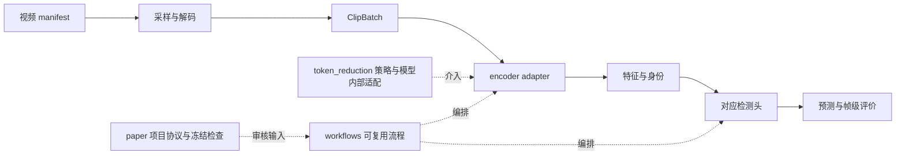

# 当前架构：框架、压缩方法与论文流程

更新：2026-09-30。本文描述当前维护源码；早期环境与回执见
[2026-09-11 实施记录](../progress/2026-09-11-implementation.md)。
本轮测试与服务器同步状态见[整理执行状态](../../projects/icassp2027/organization/EXECUTION_STATUS.md)。

## 运行主链

WAVAD 是项目名，Python 包与基础 CLI 仍为 `vadbench`。代码仓库为
`/users/fotile/VAD`。大型资产经 `assets` 统一导航，物理布局见
[资产与路径](../operations/wavad-assets.md)。

## 已实现的模块边界

| 位置 | 职责 |
|---|---|
| `contracts.py` | 视频批次、encoder 输出、时间轴与真实模型能力 |
| `data/` | manifest、划分检查、采样、解码、特征数据集和公共特征身份 |
| `integrations/` | 上游模型接入；`detectors/urdmu/` 保存作者后端与精确分块推理 |
| `features.py`、`artifacts.py` | FeatureStore、预测与运行证据 |
| `models/`、`tasks.py`、`engine/` | 通用检测头、训练、推理、帧覆盖与评测 |
| `token_reduction/` | token 策略、布局与部署契约、观察/干预桥 |
| `research/` | 正常—异常观察、统计与诊断 |
| `workflows/` | pooled 提取/恢复/合并、MIL检测、质量比较、效率与DSANet流程 |
| `paper/` | 项目配置、正式/开发数据权限、冻结检查及论文矩阵编排 |
| `projects/icassp2027/` | 论文配置、协议、冻结回执、决策与文稿来源 |

通用实现不依赖 `paper`。旧 `paper` 导入入口与新路径指向同一个模块对象，旧类型路径
和模块 patch 保持有效；维护代码使用新路径。具体 API 见
[workflows README](../../src/vadbench/workflows/README.md)。

| 旧入口 | 当前实现 |
|---|---|
| `paper.compatibility` | `data.feature_contracts` |
| `paper.detection` | `workflows.detection`，兼容许可位于 `engine.compatibility` |
| `paper.extraction`、`paper.feature_resume`、`paper.feature_merge` | `workflows` 下同名模块 |
| `paper.quality_comparison`、`paper.urdmu_quality_export` | `workflows` 下同名模块 |
| `paper.efficiency`、`paper.video_efficiency` | `workflows` 下同名模块 |
| `paper.urdmu_backend`、`paper.urdmu_inference` | `integrations.detectors.urdmu.backend/inference` |

公共预测许可仍绑定 checkpoint SHA、训练身份和目标特征；默认预测继续要求精确身份匹配。
旧 `paper_identity`、`paper_detector` 与已发布 schema 名称保留，三对行尾等价摘要保持
原审核范围。源码重构不改写旧合同、旧指纹或论文结果。

## 压缩方法与模型适配

`integrations` 负责整个模型的加载、预处理、前向和读出；压缩包中的 bridge 负责内部
block、token 顺序、特殊 token、位置编码与真实介入点。只读观察桥识别模型结构，
不因此宣称支持真实变长压缩；indexed 干预及 CLIP 专用路径分别验证实际执行。

单次张量缩减契约和一次 encoder 前向的干预上下文是不同接口，分别描述方法计算与部署。
它们集中在压缩子包，提取流程使用公共部署契约。方法公式、预算和随机行为保持；
论文参数与冻结校准绑定留在项目适配层。没有新建无消费者的 `methods/` 或 registry，
压缩子包仍是仓库内可复用模块，未发布为独立安装包。

根目录的 `compression.py` 处理原有缓存策略；token 缩减使用 `token_reduction/`。

## 工作流与论文规则

正式提取、UR-DMU 训练/评价与冻结矩阵控制保留在 `paper`，因为它们审核本文指定的
合同、数据角色、checkpoint 和测试权限。它们调用公共工作流与后端；目录未整体改名。
完整视频覆盖检查移至 `engine.coverage.feature_store_coverage`，训练与提取共用。

DSANet 已有 `extract/score/quality`，质量阶段直接调用公共工作流。原生 NPY、crop
协议和作者检测头保持，未改为通用 MIL；新入口未覆盖训练或 benchmark。
旧 Python 3.9 环境沿用薄启动器，见[DSANet说明](../../src/vadbench/workflows/dsanet/README.md)。

## 配置与产物

当前 ICASSP profile active 为 `videomaev2`、`videomae`、`timesformer`。
V-JEPA 2 的全局 catalog、上游实现和历史资产保留。CLIP–DSANet 使用单独流程配置。

默认新运行根为 `assets/experiments/icassp2027/runs`；输出解析允许 `assets` 链接到
外置数据盘，协议和模型定义等输入继续执行仓库路径约束。`status` 与 dry-run 不创建
目录、不加载模型。显式输出根继续有效，历史 run 不随默认值改变而移动。

解码后的公共输入为 `[B,T,H,W,3]` 的 `uint8`，带源帧索引、时间和视频身份；模型预处理
由 adapter 完成。FeatureStore 以 `index.jsonl` 保存身份、时间与文件引用，大数组
放 NPY/NPZ。DSANet 原生特征保持自己的格式，catalog 统一登记路径、来源、格式与QA。
失败、partial、正式结果和重试保留各自身份。

## 验证范围

本轮检查旧/新导入、通用层不依赖 `paper`、pooled 抽取—训练—预测、身份许可、
恢复/合并、压缩执行契约与 profile 输出路径。测试数量、解释器与跳过原因以执行状态为准。
新运行记录真实代码身份；历史精确重放使用归档执行快照。重构不产生新的正式质量或速度结论。
