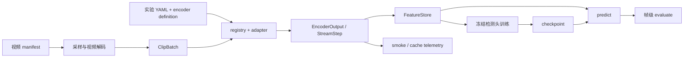

# 当前架构：配置、运行路径与产物

更新日期：2026-09-11；代码基于 `0badc34` 的本轮工作树改造。验证与部署身份见[实施记录](../progress/2026-09-11-implementation.md)。

## 两条主流程

抽取已经统一使用经过校验的生效配置和权重身份，path/ID 互斥调用已删除。正式特征链由 `cli.py` 串起 manifest、采样、adapter、特征仓、检测头与评测。模型接入验证由 `smoke.py`、`engine/integration_matrix.py` 和服务器 v2 launcher 编排，使用真实视频但不需要人工异常标签。性能 runner 位于 `benchmark.py`/`benchmark_plan.py`，逐 case 运行并汇总计时；它不会训练检测头或自动计算模型精度。

## 模块责任

| 模块 | 当前责任 |
|---|---|
| `contracts.py` | ClipBatch、时间轴、输出、能力和 stream/cache 公共契约 |
| `config.py` / `orchestration.py` | 结构校验、能力请求、definition 与 constructor 合并、microbatch、外部压缩策略 |
| `registry.py` / `integrations/catalog.py` | 惰性注册及运行 catalog；列表不会加载重模型 |
| `integrations/` | 上游加载、预处理、特征阶段、状态和 worker 边界 |
| `data/` | manifest、防泄漏、UCF 导入、容器元数据、采样、解码、特征数据集与目标投影 |
| `features.py` / `artifacts.py` | blob 与索引、预测、指标、运行信息及缓存事件 |
| `models/heads.py` / `tasks.py` | Attention/Top-k MIL、时序监督 head 与损失 |
| `engine/` | 抽取、冻结检测头训练、checkpoint 推理、帧评测和接入矩阵 |
| `benchmark.py` / `benchmark_plan.py` | warmup/repeat、CUDA 同步、时间与显存统计、采样可比性检查 |
| `scripts/server/` | 离线部署、环境/overlay、资产检查与跨环境 native smoke |
| `lab_anomaly/` | 旧应用与训练栈；旧模块重导出主包中的 VideoMAE V2 包装器，主 adapter 不再依赖旧包 |

## 配置与实际资产

`resolve_encoder_config()` 是唯一的模型构造配置入口。它合并 registry defaults、encoder definition constructor、实验 `encoder.params` 和显式 device；`create_encoder_from_experiment()` 校验权重后只构造一次模型，并返回同一份生效 definition 与 identity。

definition 的 `checkpoint.constructor_key` 明确哪个参数承载权重。显式 `encoder.checkpoint` 从 registry 选择相应资产；没有绑定、ID不存在、adapter不匹配或同时覆盖权重参数都会报错。本地绑定参数始终解析为绝对路径，identity 取实际加载路径的文件摘要，避免另一份metadata路径代表模型。

顶层 `encoder.model/precision` 已被拒绝，模型特有选项写 `encoder.params`。无消费者的 encoder fingerprint 别名也不再接受。指纹覆盖实际参数、权重内容、采样、streaming策略和代码身份；设备/部署位置与内容身份分开。文件摘要统一由 `hashing.sha256_file` 提供，特征、checkpoint、smoke与worker不再各自实现同一算法。

外部压缩由 `streaming.compression.policy` 控制；HERMES 原生 `native_compression_mode/kv_size` 是constructor参数。`identity` 不等于关闭原生策略；主弱监督配置显式设为raw/off，性能计划里的native predict case仍单独开启。

## 特征与时序

所有 adapter 输出相同形状契约，不代表相同语义。固定 clip 的 pooled vector、空间 patch token、视觉记忆和 decoder contextual token 的可比范围不同。详细阶段与运行时见[编码器运行机制](encoder-runtime.md)。

固定段采样先构造分段，再在段中心选 clip；`segment_frame_ranges` 表达段覆盖范围，`TokenTimeline` 表达输出 token 的支持范围，两者用途不同。冻结 head 数据集会构造 MIL bag；这与上游特征天然就有 32 个时间段不是一回事。详见[数据与评测](data-and-evaluation.md)。

## 产物边界

实验 YAML 的 `output.root` 与 `output.run_name` 决定默认运行目录。现有示例是 `outputs/<run_name>/`。`FeatureStore` 以 JSONL 索引保存身份与时间信息，大 tensor 放 NPY/NPZ；预测按 `prediction-v1` 存储，训练另保存 checkpoint 与 history。

已有 schema 包含 video manifest、dataset audit v1/v2、feature index、prediction、候选/catalog/环境、smoke v2、performance及stage v1。旧audit v1保留历史契约，新官方评测需要v2的manifest与官方源文件身份；普通metrics/cache事件仍使用各自Python类型约束。

`record_stage()` 为 extract/train/predict/evaluate/benchmark 每次创建独立的 `provenance/stages/<id>.json`，写入 running/completed/failed、配置摘要、输入文件身份、代码与环境，失败也保留原因。它不覆盖旧attempt；smoke/matrix使用各自版本化结果并默认拒绝已有输出。

## 计时与公平性

benchmark 每次 warmup/repeat 都执行 decode、preprocess 和 adapter；encoder 时间包含 adapter 内部预处理及原生压缩。`native_compression` 是 telemetry 给出的嵌套子项，不能再加到 wall time。默认真实benchmark按环境registry选择独立Python，每个case在实际模型进程内完成warmup/repeat、CUDA同步与显存统计；只显式注入factory的测试走当前进程。原生smoke与benchmark共用环境选择和环境变量构建，原有JSON视频列表worker路径已删除。

`comparison.comparable` 核对有序帧坐标、输入尺寸、数量、源时间覆盖、任务与特征阶段等。它没有证明不同 adapter 内部 resize/crop/normalization 相同，也没有证明检测头与训练条件一致。`accuracy_eligibility` 只判断读出阶段是否具备条件，不是准确率证据。模型间系统对照与同基座缓存消融要分开报告。
